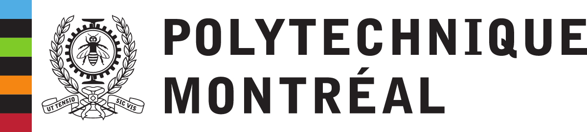
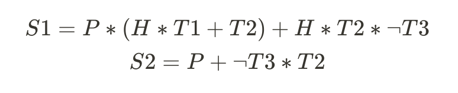
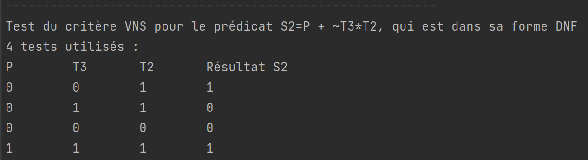

# LOG3430 TP 2
- Auteurs : Nerese Carlens && Thomas Julien
- le dépot Github dispo [ici](https://github.com/korrigans84/test-python)
## Partie 1

L'objectif de ce TP est de recouvrir les critères de tests RACC & RICC pour les 2 prédicats suivants : 



Dans un second temps, nous chercherons le jeu de tests qui satisfait le critère VNS pour le prédicat S2.

### Execution
Pour lancer la partie code du TP, vous pouvez executer la commande 
```bash 
./run.sh
```

Cela produira en console le jeu de test pour le critère VNF du prédicat S2, et créera aussi un fichier **parameters.json**
à la racine du projet, qui contient l'ensemble des jeux de tests satisfaisant les critères RACC ou RICC, pour chaque
clause majeure des prédicats S1 et S2.

